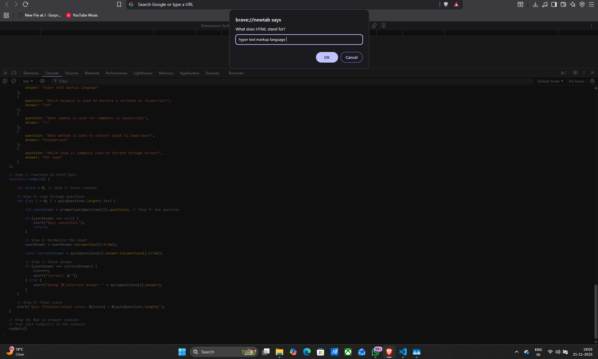
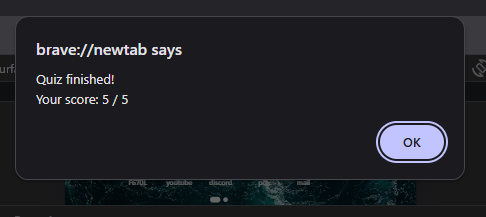

# Lab Assignment 4 – JavaScript Console Quiz

## Author
**Tanishq Sethi**

---



## 📘 Overview
This project is a JavaScript-based interactive quiz that runs inside the **browser console**.
Users are asked a series of questions, and their answers are evaluated instantly.

---

## 🧠 Features
- Array of objects storing questions & answers  
- Uses a **for loop** to run through the quiz  
- Accepts user input using `prompt()`  
- Gives feedback using `alert()`  
- Converts input to lowercase using `toLowerCase()`  
- Removes extra spaces using `trim()`  
- Tracks score  
- Displays final results  

---

## 📁 Files Included
### **quiz.js**
Contains the complete JavaScript quiz program.

---

## ▶️ How to Run the Quiz

1. Open **Google Chrome**
2. Right click → **Inspect** → open **Console**
3. Paste the code from `quiz.js`
4. Run the quiz by typing:
   ```js
   runQuiz()
   ```
5. Press **Enter** and start answering questions 🎉

---

## 📊 Expected Output
After all questions are answered:
```
Quiz finished!
Your score: X / 5
```

---

## 📝 Question Format Example
```js
{
    question: "What does HTML stand for?",
    answer: "hyper text markup language"
}
```

---

## 🛠 Optional Upgrades
These are not required for the assignment, but you can add them:

- Timer-based quiz  
- Multiple-choice questions  
- Save scores using `localStorage`  
- UI version using HTML + CSS  

---

## ✔ Assignment Requirements Checklist

| Requirement | Status |
|------------|--------|
| Array of questions | ✅ |
| Quiz function | ✅ |
| Score calculation | ✅ |
| Input using prompt | ✅ |
| Alerts for feedback | ✅ |
| Input normalization | ✅ |
| Final score output | ✅ |

---

## 📌 Note  
This README is fully formatted and ready to attach with your Lab Assignment 4 submission.

